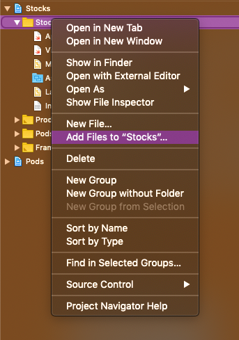
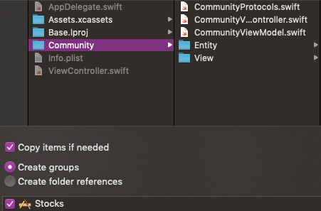
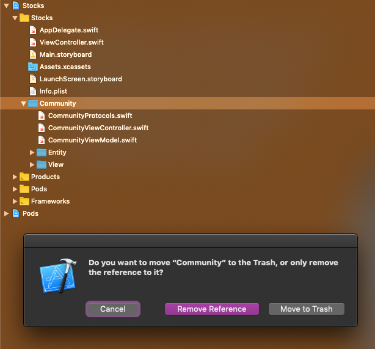
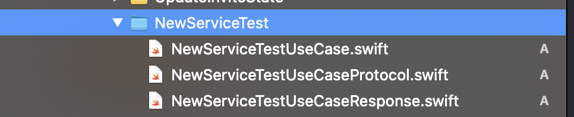

# View Code Template
xctemplate for create view code based in protocols

# UseCase Template
xctemplate for create new UseCase code based in protocols and RxSwift

## What is it? ##
This repo stores XCode templates, that allows you to create View Code with protocols in Swift.

## How to use? ##
If you are using Xcode just go to `~/Library/Developer/Xcode/` folder, Create the folder 'Templates', Then inside Templates create folder 'File Templates'. add `View Code Template.xctemplate` and `UseCase Template.xctemplate` there. That's it. Now you can find your template in XCode -> New File -> iOS -> File Templates

## Issues ## 

Some of you may have already noticed that something is wrong with the folder created. The color signals that it’s not a group and if you try to instantiate the View from somewhere in the rest of the app, you will be unable to do so.

This is happening because the template creates just a folder and not actually an Xcode group, so all the files inside the module are not members of the app target. Sadly, after some research, it seems that it is not currently possible to create a new group when you use a new file template, only when creating a template for a new project. A quick solution is to create the group from the folder and then delete the reference to the initial folder.

Point to the parent folder, right click and choose “Add files to “…””.

A new window will pop up. There, choose the root folder of your module, and pick “Create groups” for the field “Added folders”. Then press “Add”.

The new group is created, and now we can safely right click on the old folder of our module, choose “Delete” and pick the option “Remove reference”.

This is structure created for UseCase

The new module is ready to be used!
